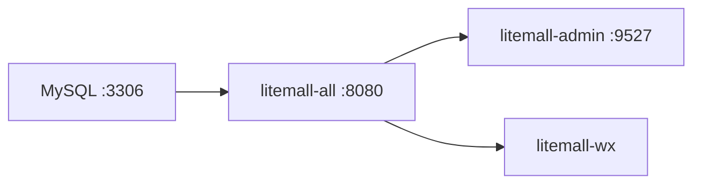

# 本地启动指南

本文档基于 Windows 本地环境实际部署验证整理，适用于 **后端 + 管理后台 + 微信小程序（litemall-wx）** 开发联调。

## 一、环境要求

| 工具 | 版本要求 | 用途 |
|------|----------|------|
| JDK | 1.8+ | 后端编译与运行 |
| Maven | 3.x | 后端构建 |
| MySQL | 5.7 / 8.0 | 数据库 |
| Node.js | 建议 16.x 或 18.x（24.x 可用但有警告） | 管理后台前端 |
| 微信开发者工具 | 最新稳定版 | 小程序调试 |

## 二、项目结构速览

```
sheep_litemall/
├── litemall-all/          # 统一后端入口（推荐，端口 8080）
├── litemall-admin/        # 管理后台前端（端口 9527）
├── litemall-wx/           # 微信小程序（推荐）
├── litemall-vue/          # 轻商城 H5（开发中，可选）
├── renard-wx/             # 备选小程序（功能较少）
└── litemall-db/sql/       # 数据库脚本
    ├── litemall_schema.sql   # 建库、建用户
    ├── litemall_table.sql    # 建表
    └── litemall_data.sql     # 测试数据（必需）
```

## 三、数据库初始化

### 3.1 连接信息（默认）

导入 `litemall_schema.sql` 后，应用使用的数据库账号为：

| 项 | 值 |
|----|-----|
| 地址 | `localhost:3306` |
| 数据库 | `litemall` |
| 用户名 | `litemall` |
| 密码 | `litemall123456` |

配置文件：[litemall-db/src/main/resources/application-db.yml](../litemall-db/src/main/resources/application-db.yml)

若本地 MySQL 账号密码不同，请修改上述 yml 文件。

### 3.2 导入 SQL（顺序不可颠倒）

使用 **MySQL root** 执行。PowerShell 示例：

```powershell
# 1. 建库、建用户（会 drop 已有 litemall 库）
cmd /c "mysql -u root -p你的root密码 < d:\coding\sheep_litemall\litemall-db\sql\litemall_schema.sql"

# 2. 建表（必须指定 litemall 库）
cmd /c "mysql -u root -p你的root密码 litemall < d:\coding\sheep_litemall\litemall-db\sql\litemall_table.sql"

# 3. 导入测试数据
cmd /c "mysql -u root -p你的root密码 litemall < d:\coding\sheep_litemall\litemall-db\sql\litemall_data.sql"
```

> **注意：** `litemall_table.sql` 和 `litemall_data.sql` 不含 `USE litemall;`，导入时必须显式指定数据库名。

### 3.3 验证导入成功

```sql
USE litemall;
SELECT COUNT(*) FROM litemall_admin;   -- 应有管理员（约 3 条）
SELECT COUNT(*) FROM litemall_region;  -- 应有省市区（约 3000+ 条）
SELECT COUNT(*) FROM litemall_goods;   -- 应有示例商品（约 200+ 条）
```

### 3.4 缺失 litemall_data.sql 时

从上游仓库拉取：

```powershell
Invoke-WebRequest -Uri "https://raw.githubusercontent.com/linlinjava/litemall/master/litemall-db/sql/litemall_data.sql" -OutFile "d:\coding\sheep_litemall\litemall-db\sql\litemall_data.sql"
```

## 四、后端启动

### 4.1 编译

```powershell
cd d:\coding\sheep_litemall
mvn install -DskipTests
mvn clean package -DskipTests
```

产物：`litemall-all/target/litemall-all-0.1.0-exec.jar`

**Maven 镜像超时：** 若 `maven.aliyun.com` 连接失败，可临时使用 Maven Central：

```powershell
mvn install -DskipTests -s d:\coding\sheep_litemall\.mvn-central-settings.xml
```

### 4.2 启动统一后端（推荐）

```powershell
java "-Dfile.encoding=UTF-8" -jar d:\coding\sheep_litemall\litemall-all\target\litemall-all-0.1.0-exec.jar
```

> PowerShell 中 JVM 参数 `-Dfile.encoding=UTF-8` 必须加引号，否则启动失败。

### 4.3 验证后端

| 地址 | 说明 |
|------|------|
| http://localhost:8080/doc.html | Swagger API 文档 |
| http://localhost:8080/wx/home/index | 小程序首页 API |
| http://localhost:8080/admin/auth/login | 管理后台登录 API |

### 4.4 独立模块启动（可选）

| 模块 | 端口 | 说明 |
|------|------|------|
| litemall-all | 8080 | 管理端 + 商城端合一 |
| litemall-admin-api | 8083 | 仅管理 API |
| litemall-wx-api | 8082 | 仅商城 API |

开发联调推荐使用 `litemall-all`，一个 jar 即可。

## 五、管理后台前端启动

```powershell
cd d:\coding\sheep_litemall\litemall-admin
npm install --registry=https://registry.npmjs.org --legacy-peer-deps
npm run dev
```

浏览器访问：**http://localhost:9527**

| 项 | 值 |
|----|-----|
| 默认账号 | `admin123` |
| 默认密码 | `admin123` |
| API 代理 | `/admin` → `http://localhost:8080` |

**npm 安装失败：** 若 `registry.npmmirror.com` 超时，改用 `https://registry.npmjs.org`。

## 六、微信小程序启动（litemall-wx）

1. 打开 **微信开发者工具**
2. 导入项目目录：`d:\coding\sheep_litemall\litemall-wx`
3. **详情 → 本地设置** → 勾选 **「不校验合法域名、web-view（业务域名）、TLS 版本以及 HTTPS 证书」**
4. 点击 **编译**

API 地址已在 [litemall-wx/config/api.js](../litemall-wx/config/api.js) 配置为：

```
http://localhost:8080/wx/
```

本地开发无需修改。

## 七、推荐启动顺序

```
1. 启动 MySQL
2. 确认数据库已导入（首次需执行三个 SQL）
3. 启动后端 jar（8080）
4. 启动 litemall-admin（9527）
5. 微信开发者工具打开 litemall-wx
```



## 八、端口汇总

| 服务 | 端口 |
|------|------|
| 统一后端 | 8080 |
| 管理后台 | 9527 |
| MySQL | 3306 |

## 九、常见问题

| 现象 | 原因 | 处理 |
|------|------|------|
| 后端启动报 DB 连接失败 | MySQL 未启动或密码不匹配 | 检查 3306 端口和 application-db.yml |
| PowerShell 启动 jar 报错 | `-D` 参数被误解析 | 使用 `java "-Dfile.encoding=UTF-8" -jar ...` |
| 管理后台登录失败 | 未导入 data.sql | 重新导入 litemall_data.sql |
| 管理后台 502/404 | 后端未启动 | 先确认 8080 可用 |
| 小程序首页空白 | 后端未启动或域名校验未关闭 | 检查 API 请求、关闭域名校验 |
| Maven 下载超时 | 阿里云镜像网络问题 | 使用 `.mvn-central-settings.xml` 或换镜像 |
| npm install 卡住/超时 | npmmirror 不可达 | 改用 `registry.npmjs.org` |
| 地址选择异常 | 缺少 region 数据 | 确认 litemall_region 表有数据 |

## 十、本地无法使用的功能

以下功能需要真实第三方配置，本地开发可忽略：

- 微信登录 / 微信支付（需真实 appid、mch-id）
- 短信通知、邮件通知
- 云存储（OSS/COS/七牛，默认使用本地存储）

相关占位配置见 [litemall-core/src/main/resources/application-core.yml](../litemall-core/src/main/resources/application-core.yml)。

## 十一、停止服务

- 后端 / 前端：在对应终端按 `Ctrl + C`
- MySQL：按需停止 Windows 服务 `mysql80`
